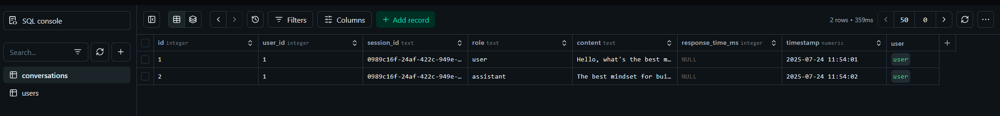
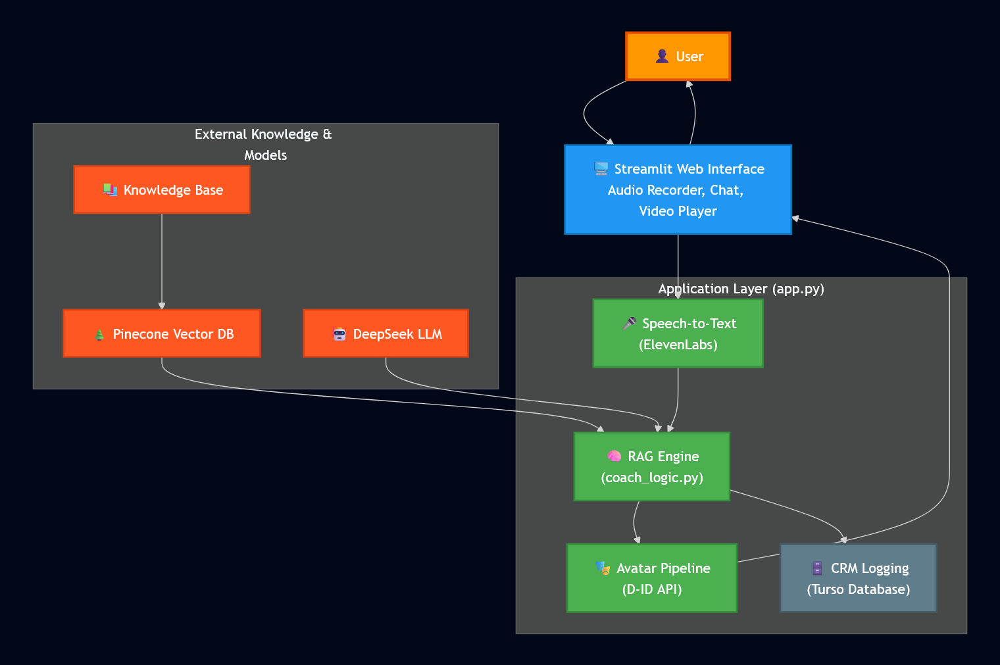

# Task 1: AI Avatar Coach (A Conversational RAG Experience)

### 🔴 Live Demo
**https://task1avatarcoach.streamlit.app/**

---

### Brief Explanation

The goal of this task was to build a conversational avatar experience. Users interact with a voice-enabled, talking AI coach who provides guidance based on a dedicated knowledge base about wealth, success, and mindset. The project focuses on creating a seamless, engaging loop from voice input to a generated avatar video response, with all interactions logged to a persistent cloud database for long-term analysis.

---

### ✨ Key Features

- **Talking Head Avatar (D-ID Integration)**: Generates dynamic, fluent talking head videos from text, creating a lifelike and engaging user experience. The system includes robust polling to handle video processing times.

- **Voice-Enabled Conversation (ElevenLabs)**: Implements a full voice-to-voice loop. It uses ElevenLabs' Speech-to-Text for transcription.

- **Knowledge Base Integration (RAG Architecture)**: The AI's intelligence is grounded in a custom `knowledge_base.txt`. Using a Pinecone vector database and `SentenceTransformer` embeddings, the system performs semantic searches to retrieve relevant knowledge chunks, preventing the AI from hallucinating and ensuring its advice is contextually accurate.

- **Persistent Conversation Logging (Cloud CRM)**: Every user interaction and AI response is logged to a cloud-hosted Turso (SQLite) database. This acts as a CRM, ensuring data is saved across sessions and deployments.

  *Evidence of successful CRM logging:*
  

- **Encouraging AI Persona**: A carefully engineered system prompt in `coach_logic.py` defines the AI's persona as a wise, encouraging, and insightful coach, instructing it to always end its responses with an open-ended question to foster continuous conversation.

- **Resilient Fallbacks**: The application is designed to be robust. If the D-ID video generation fails or is disabled, the system gracefully falls back to a high-quality audio-only response from ElevenLabs.

---

### 🏛️ Architecture

This application is built using a modern Retrieval-Augmented Generation (RAG) architecture, combined with a real-time avatar generation loop and a cloud-based CRM.

---

### 🧠 Prompt Logic

The AI's personality and behavior are governed by the system prompt in `coach_logic.py`. This prompt establishes the "rules of the game" for the LLM.

- **Persona Definition**: The prompt begins by defining the AI's role: `"You are an AI Avatar Coach. Your persona is wise, encouraging, and insightful."`

- **Factual Grounding**: The prompt enforces strict adherence to the retrieved data with a non-negotiable rule: `"You MUST base your answer primarily on the information within these Knowledge Chunks."` This prevents the AI from making up information.

- **Graceful Failure**: It includes instructions for cases where the knowledge base lacks relevant information: `"If the user's question is not covered by the knowledge, state that you do not have specific information on that topic..."`

- **Conversational Engagement**: To ensure the dialogue is interactive, the prompt mandates: `"End your response with an open-ended question to encourage the user to continue the conversation."`

- **Context Injection**: Before the final LLM call, the retrieved text from Pinecone is formatted and injected into the conversation history with a clear `CONTEXT:` label, giving the AI the exact raw material it needs to formulate its grounded response.