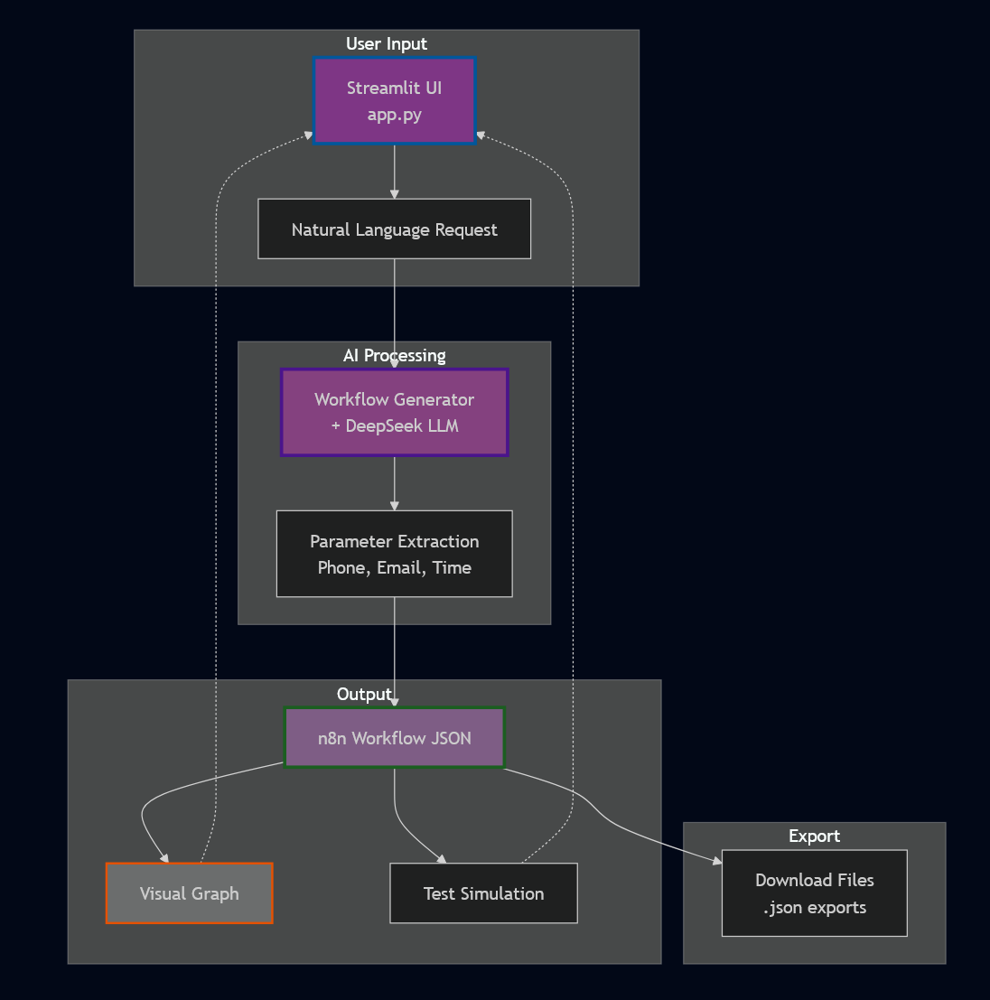

# Task 2: Real-Time Agentic AI Flow Builder (Meta-Agent for n8n Workflow Automation)

### 🔴 Live Demo
**https://task2metaagent.streamlit.app/**

---

### Brief Explanation

The goal of this task was to design an AI agent that can generate automation logic based on user intent, a no-code meta-agent that builds n8n-like workflows from natural language chat input. The agent interprets complex automation requests, breaks them into structured logic steps, and produces ready-to-deploy workflow configurations with visual previews.

---

### ✨ Key Features

- **Natural Language Understanding**: Converts plain English automation requests into structured n8n workflows using DeepSeek LLM to parse intent and map to appropriate node types.
- **Smart Parameter Extraction**: Automatically extracts phone numbers, emails, Slack channels, and time schedules from user input using regex patterns and enhances the workflow nodes.
- **13 Node Types Support**: Handles 5 trigger types (Jotform, Schedule, Webhook, CRM, Email) and 8 action types (WhatsApp, Email, Slack, Telegram, Google Sheets, HTTP, CRM updates).
- **Visual Workflow Builder**: Interactive graph visualization using streamlit-agraph with color-coded nodes (blue diamonds for triggers, branded colors for actions).
- **Workflow Validation**: Validates generated workflows for structural integrity, checking for missing triggers, invalid connections, and required parameters.
- **Test Simulation**: Allows users to preview workflow execution step-by-step before export, showing how data flows through each node.
- **Export Capabilities**: Generates both n8n-compatible JSON and human-readable reports with metadata for easy import into automation platforms.

---

### 🏛️ Architecture

This meta-agent uses a multi-stage processing pipeline to transform natural language into executable workflows. The diagram below illustrates the flow of data and component interactions.

---

### 🧠 Prompt Logic

The meta-agent's intelligence is controlled by the system prompt in `workflow_generator.py`. The prompt engineering involves several components:

- **JSON Format Enforcement**: The prompt begins with "CRITICAL: Return ONLY valid JSON" to prevent markdown wrapping issues that can break parsing.

- **Structured Output Requirements**: The LLM must return exactly two keys: "summary" (human-readable steps) and "workflow" (n8n-compatible JSON), ensuring consistent output format.

- **Node Type Definitions**: The prompt includes detailed specifications for all 13 supported node types, including required parameters and proper n8n type strings (e.g., `n8n-nodes-base.whatsApp`).

- **Parameter Guidelines**: Specific instructions for extracting and formatting different data types:
    - Phone numbers: Multiple format support with international prefixes
    - Time conversion: Natural language to cron expressions (e.g., "9 AM daily" → "0 9 * * *")
    - Smart defaults: Placeholders like "[PHONE_NUMBER]" when data is missing

- **Workflow Rules**: Instructions for handling complex scenarios like parallel actions (multiple nodes from same source) and conditional logic (after-hours routing).

- **Post-Processing Enhancement**: After LLM generation, the system runs parameter extraction to catch any missed data and validates the workflow structure before presentation.

---

### 📋 Example Workflows Generated

1. **Multi-Channel Customer Response**: "When Jotform submitted, WhatsApp customer and email team"
- Creates parallel notification workflow with extracted contact details

2. **Time-Based Automation**: "Every day at 9 AM, update Google Sheets and send Slack summary"
- Generates scheduled workflow with proper cron expression

3. **Complex Business Logic**: "When payment webhook fires, update CRM, notify customer via WhatsApp, and alert finance team on Slack"
- Produces multi-action workflow with conditional routing