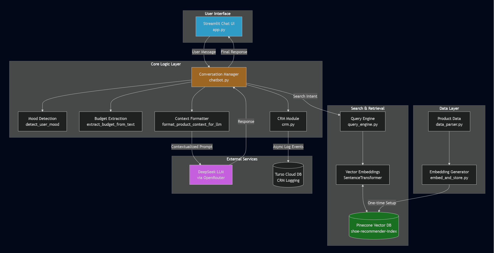

# Task 3: AI-Personalized Shoe Recommender (Bob, the Malaysian AI Shoe Salesman)

### 🔴 Live Demo
**https://task3chatbotshoerecommender.streamlit.app/**

---

### Brief Explanation

The goal of this task was to develop a conversational AI recommender that suggests products based on a user's personality, budget, mood, and contextual preferences. The agent, "Bob," is designed to provide highly contextual, non-keyword-based suggestions and infer emotional tone and lifestyle hints from the user's input.

---

### ✨ Key Features

- **Emotional Intelligence**: Detects user mood (stressed, excited, budget-conscious, etc.) from their messages and adapts its response style accordingly.
- **Budget Awareness**: Automatically extracts budget constraints (e.g., "under RM100", "around RM200") from text and filters product searches in the vector database.
- **Semantic Search**: Uses a Pinecone vector database with SentenceTransformer embeddings for contextual product matching that goes beyond simple keywords.
- **Personalized Tips & Promos**: The AI is programmed with business logic to provide relevant follow-up tips (e.g., shoe care, sizing advice) and announce sales or free delivery thresholds.
- **Conversation Memory**: Remembers the last product it recommended using Streamlit's `session_state`, allowing it to accurately answer follow-up questions about price, features, or links without hallucinating.
- **CRM Logging Turso Database**: Logs conversational events to a cloud-based Turso database, capturing:
    - User messages and bot responses in separate columns for easy analysis
    - User mood and emotional context detection
    - Product recommendations and search failures
    - Budget preferences and shopping urgency
    - Complete interaction history for business intelligence

  *Evidence of successful CRM logging:*
  

---

### 🏛️ Architecture

This agent is built using a Retrieval-Augmented Generation (RAG) architecture. The diagram below illustrates the flow of data and the interaction between components.

---

### 🧠 Prompt Logic

The intelligence of the "Bob" persona is controlled by a  system prompt in `chatbot.py`. It involves several key layers:

- Persona Definition: The prompt begins by clearly defining Bob's persona: "a friendly, emotional, and humorous shoe store assistant from Malaysia."

- Strict Rules & Factual Grounding: To prevent the LLM from hallucinating, the prompt includes non-negotiable rules. The most important rule is that the AI MUST use the factual CONTEXT (which contains the product data retrieved from Pinecone) to answer questions about price, features, and discounts.

- Adaptive Behavior: The prompt instructs the AI to adapt its tone based on the user's detected mood (e.g., "If stressed: Be extra calming..."). This makes the interaction feel more personalized and empathetic.

- Knowledge Base: Store-wide business policies that are always true (like the logistics and return policies) are included as a "Knowledge Base" for the AI to reference.

- Context Injection: The final step before calling the LLM is to inject the retrieved product data and user analysis directly into the conversation history with the label CONTEXT:. This provides the AI with the precise, fact-checked information it needs to construct its response.